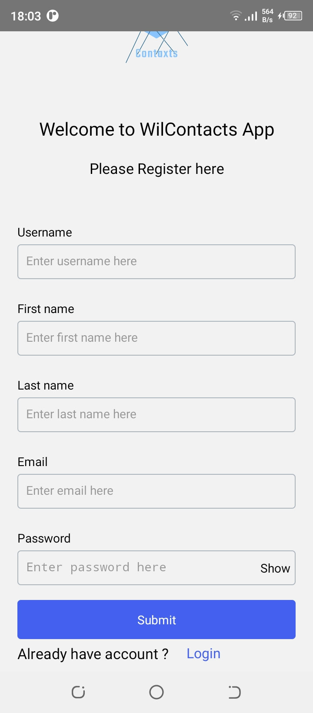
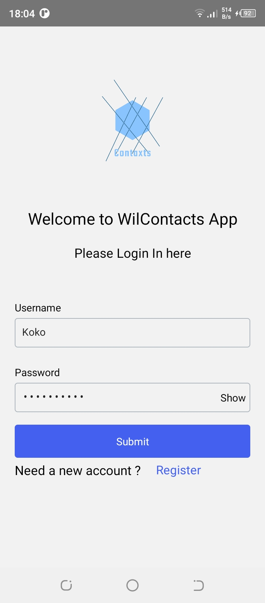
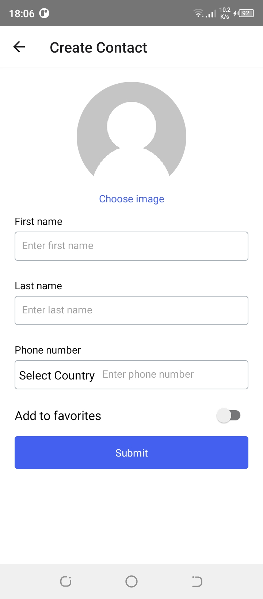
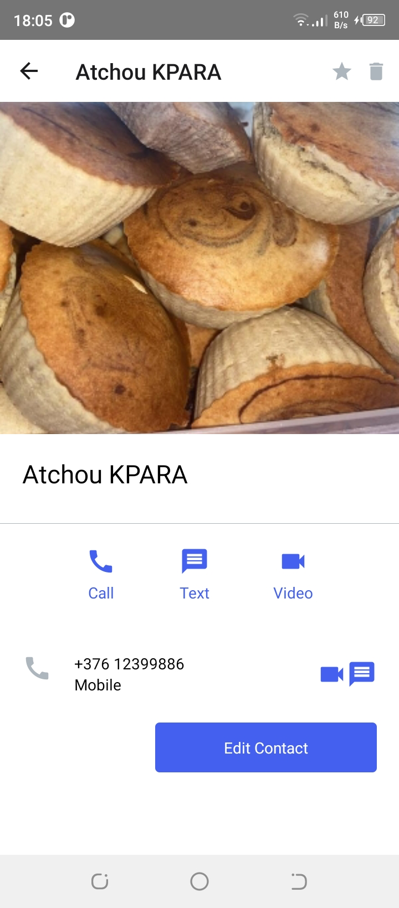
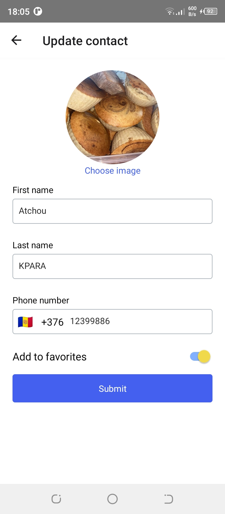
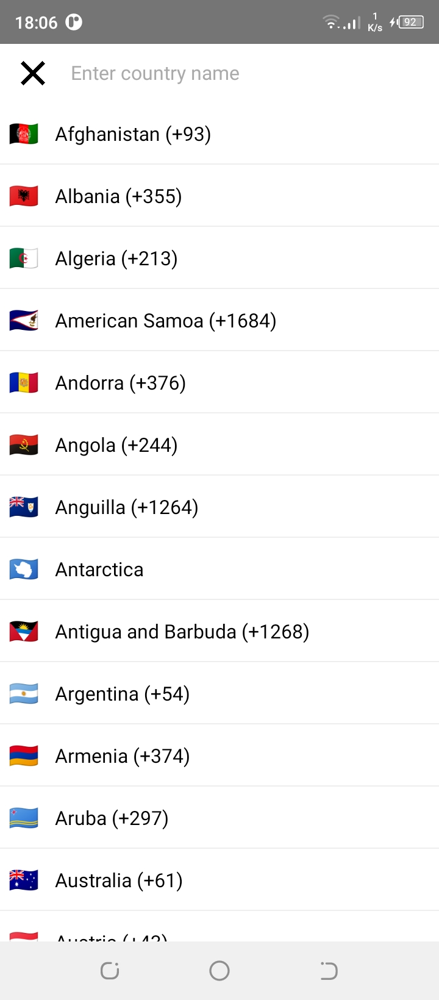
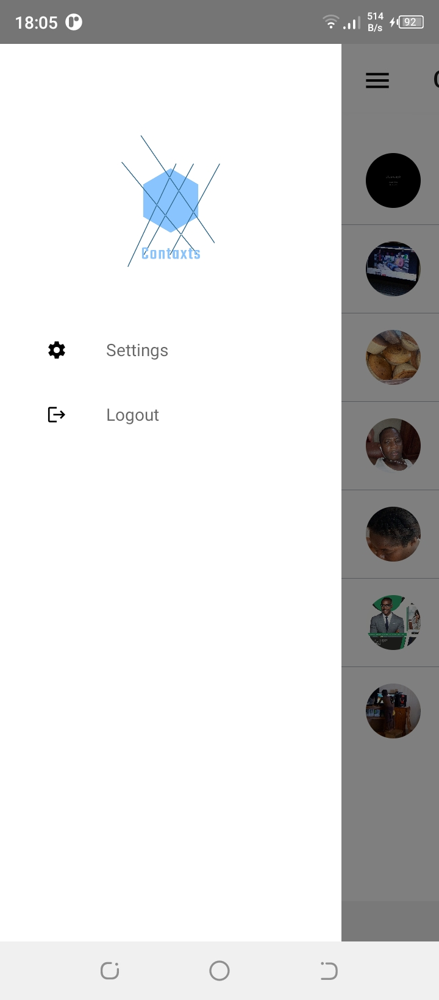

# WilContacts

This project is a full React Native Contact Book App built from scratch using the [React Native CLI](https://reactnative.dev/docs/environment-setup).

## Freatures & libraries used

### User registration

### User authentication

### Add, preview, update and delete a contact (CRUD)

### Add and edit contact picture

### Add country picker to manage  contact phone numbers

### Others

## Libraries
- [Axios](https://www.npmjs.com/package/axios) to requests purpose 
PS. We use a backend [REST API](https://truly-contacts.herokuapp.com/api).
- [React Native Bootsplash](https://github.com/zoontek/react-native-bootsplash) to design the Splash screen
- [React Native Async Storage](https://github.com/react-native-async-storage/async-storage) to save user preferences locally to avoid multiple api requests
- [react-native-image-crop-picker](https://github.com/ivpusic/react-native-image-crop-picker) for the contact picture feature
- [React Native Firebase](https://rnfirebase.io) and Google Firebase storage to store the images while assigning the uri to the contact data in the API
- [React Native Country Picker Modal](https://github.com/xcarpentier/react-native-country-picker-modal) for country code picker for contacts phone 

Big thanks to : [Cryce Truly's Full React Native project Tutorial for Beginners](https://www.youtube.com/watch?v=npe3Wf4tpSg&t=36029s) for his amazing course.
